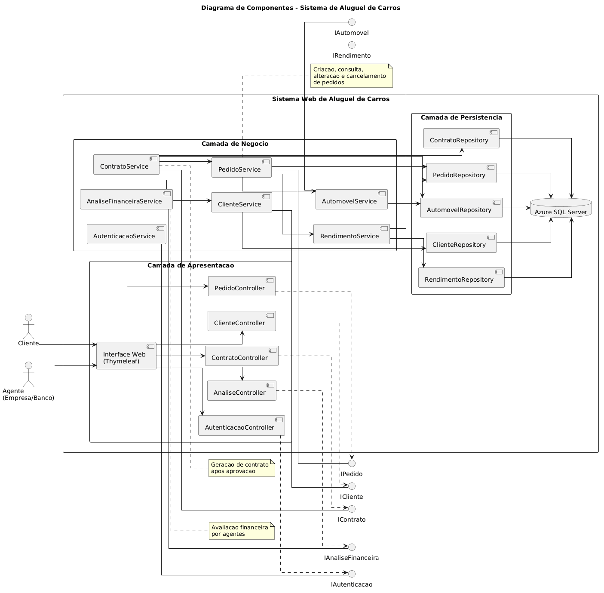
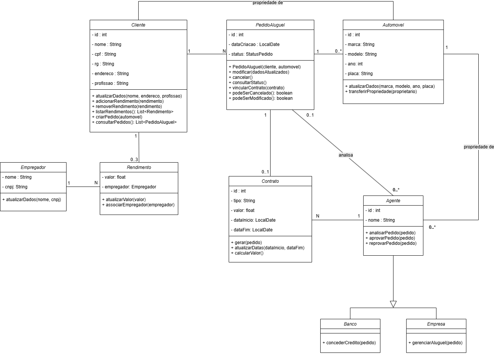

<div align="center">


<p>
  <strong>Projeto acadêmico</strong> da disciplina de <strong>Laboratório de Desenvolvimento de Software</strong>
  para modelagem e implementação de uma plataforma web de <strong>aluguel de automóveis</strong>.
</p>

<p>
  Clientes • Pedidos • Análise financeira • Contratos • Propriedade de veículos
</p>

<p>
  
  
  
  
  
  
</p>

<p>
  <a href="#sobre-o-projeto"></a>
  <a href="#identidade-visual"></a>
  <a href="#arquitetura-proposta"></a>
  <a href="#diagramas-do-projeto"></a>
  <a href="#historias-de-usuario"></a>
  <a href="#como-executar"></a>
</p>

</div>

---

## Visão rápida

| Item | Resumo |
|---|---|
| **Contexto** | Projeto acadêmico para modelagem e implementação incremental de um sistema de aluguel de carros |
| **Arquitetura alvo** | Aplicação web em `Java` com padrão `MVC` |
| **Stack principal** | `Micronaut`, `Thymeleaf`, `JPA/Hibernate`, `Azure SQL Server`, `Gradle` |
| **Foco funcional** | Clientes, pedidos, análise financeira, contratos e propriedade do automóvel |
| **Situação atual** | Modelagem concluída, base técnica pronta, autenticação implementada e fluxo web de criação de `PedidoAluguel` funcional |

## Sumário

- [Sobre o projeto](#sobre-o-projeto)
- [Objetivos do sistema](#objetivos-do-sistema)
- [Estado atual do repositório](#estado-atual-do-repositorio)
- [Identidade visual](#identidade-visual)
- [Arquitetura proposta](#arquitetura-proposta)
- [Diagramas do projeto](#diagramas-do-projeto)
- [Modelo de domínio](#modelo-de-dominio)
- [Regras de negócio](#regras-de-negocio)
- [Histórias de usuário](#historias-de-usuario)
- [Estrutura atual do projeto](#estrutura-atual-do-projeto)
- [Como executar](#como-executar)
- [Roadmap sugerido](#roadmap-sugerido)
- [Referências](#referencias)

<a id="sobre-o-projeto"></a>
## Sobre o projeto

O sistema foi concebido para permitir que clientes realizem pedidos de aluguel de automóveis pela internet, enquanto agentes, como empresas e bancos, possam analisar a viabilidade financeira dessas solicitações.

Após a aprovação do pedido, o sistema deve possibilitar a geração de contrato e refletir a propriedade do automóvel conforme as regras definidas pelo tipo de contrato.

> **Resumo executivo**
>
> A proposta do projeto é reunir em uma única aplicação web os fluxos de **cadastro**, **autenticação**, **gestão de pedidos**, **análise financeira** e **formalização contratual**, mantendo alinhamento com a modelagem UML e com os requisitos acadêmicos definidos na disciplina.

<a id="objetivos-do-sistema"></a>
## Objetivos do sistema

De acordo com a especificação do laboratório, o sistema deve:

- permitir cadastro e autenticação de clientes;
- permitir criar, consultar, modificar e cancelar pedidos de aluguel;
- permitir que agentes analisem, aprovem ou reprovem pedidos;
- gerar contrato após a aprovação;
- armazenar rendimentos do cliente, limitados a `3` registros;
- registrar automóveis e refletir sua propriedade conforme o contrato;
- atender a uma arquitetura `MVC` em `Java`.

<a id="estado-atual-do-repositorio"></a>
## Estado atual do repositório

Atualmente, o repositório já possui a base de configuração do projeto e os artefatos de modelagem, incluindo:

- configuração inicial com `Gradle`;
- definição de aplicação `Java` com `Micronaut`;
- dependências para camada web, persistência e views server-side;
- estrutura inicial em `src/main/java` e `src/main/resources`;
- classe principal da aplicação;
- configuração de datasource para `Azure SQL Server` por variáveis de ambiente;
- diagramas UML em `Diagrams/`;
- wrappers do Gradle para execução e build.

> **Importante**
>
> O projeto já possui base técnica, domínio de `Cliente`, autenticação por `CPF + senha`, sessão HTTP, área autenticada do cliente e criação web de `PedidoAluguel` com status inicial `PENDENTE`. O próximo passo natural é implementar a consulta de pedidos e a visualização de status.

### Entregáveis já produzidos e plano incremental

| Incremento | Objetivo | Sprint | Status |
|---|---|---|---|
| `0` | Modelagem inicial: casos de uso, histórias, classes, pacotes e README | `Sprint 01` | `Concluído` |
| `1` | Base técnica: `Micronaut`, `Gradle`, `Application`, `src/`, `application.yml`, Azure SQL | `Sprint 02` | `Concluído` |
| `2` | Domínio e persistência de `Cliente` | `Sprint 02` | `Concluído` |
| `3` | CRUD web inicial de `Cliente` com `Controller` + `Thymeleaf` | `Sprint 02` | `Concluído` |
| `4` | Autenticação, sessão e área protegida do cliente | `Sprint 02/03` | `Concluído` |
| `5` | Domínio e persistência de `PedidoAluguel` | `Sprint 03` | `Concluído` |
| `6` | Criação de pedido pelo cliente | `Sprint 03` | `Concluído` |
| `7` | Consulta de pedidos e visualização de status | `Sprint 03` | `Próximo` |
| `8` | Modificação e cancelamento de pedido | `Sprint 03` | `Pendente` |
| `9` | Análise de pedido por agente | `Sprint 03` | `Pendente` |
| `10` | Aprovação, reprovação e geração de contrato | `Sprint 03` | `Pendente` |
| `11` | Gestão de rendimentos e empregadores | `Sprint 03` | `Pendente` |
| `12` | Automóveis e transferência de propriedade | `Sprint 03` | `Pendente` |
| `13` | Revisão final, componentes, implantação, polimento e entrega | `Sprint 03` | `Pendente` |

### Entregas concretas já implementadas

| Entrega | Situação |
|---|---|
| Estrutura inicial do projeto | `Concluído` |
| Configuração com `Gradle` | `Concluído` |
| Base com `Micronaut` | `Concluído` |
| Estrutura `src/` | `Concluído` |
| Classe principal `Application` | `Concluído` |
| Configuração com Azure SQL Server | `Concluído` |
| Diagrama de Casos de Uso | `Concluído` |
| Diagrama de Classes | `Concluído` |
| Diagrama de Pacotes | `Concluído` |
| Diagrama de Componentes | `Concluído` |
| Diagrama de Implantação | `Concluído` |
| Entidade `Cliente` | `Concluído` |
| `ClienteRepository` | `Concluído` |
| `ClienteService` | `Concluído` |
| Testes de `ClienteService` | `Concluído` |
| `AuthService` | `Concluído` |
| `SessionAuthService` | `Concluído` |
| `PasswordHashService` | `Concluído` |
| `StatusPedido` | `Concluído` |
| `PedidoAluguel` | `Concluído` |
| `PedidoAluguelRepository` | `Concluído` |
| `PedidoAluguelService` | `Concluído` |
| `PedidoController` | `Concluído` |
| `AuthController` | `Concluído` |
| Tela inicial pública | `Concluído` |
| Tela de login | `Concluído` |
| Logout com sessão HTTP | `Concluído` |
| Hash de senha com `BCrypt` | `Concluído` |
| `HomeController` | `Concluído` |
| `ClienteController` | `Concluído` |
| Tela de listagem de clientes | `Concluído` |
| Tela de cadastro e edição de clientes | `Concluído` |
| Tela de criação de pedido | `Concluído` |
| Modal de confirmação de exclusão | `Concluído` |
| Restrição para acesso apenas ao próprio cadastro | `Concluído` |
| Normalização de CPF em cadastro, edição e login | `Concluído` |
| Recursos estáticos (`/css` e `/js`) | `Concluído` |
| Testes de `AuthService` | `Concluído` |
| Testes de `SessionAuthService` | `Concluído` |
| Testes de `PedidoAluguelService` | `Concluído` |
| Testes de `PedidoController` | `Concluído` |

<a id="identidade-visual"></a>
## Identidade visual

<div align="center">


</div>

A identidade visual do projeto foi construída para transmitir:

- **tecnologia e confiabilidade**, com tons profundos de azul;
- **mobilidade e fluxo**, com contrastes em ciano;
- **destaque e ação**, com acentos em âmbar;
- **clareza documental**, com composição limpa para GitHub e apresentação acadêmica.

### Paleta oficial da interface

| Papel visual | Cor | Uso principal |
|---|---|---|
| `Navy` | `#07111F` | base institucional e profundidade |
| `Slate` | `#102E4A` | fundos escuros e contraste |
| `Blue` | `#1D4ED8` | ação principal, links e botões |
| `Cyan` | `#4FD1C5` | destaque visual e frescor da interface |
| `Amber` | `#F59E0B` | atenção, progresso e acentos |

### Onde a identidade já está aplicada

- `README` com a mesma paleta da interface;
- banner e badges alinhados ao tema do projeto;
- telas de `Cliente` com visual moderno, clean e consistente;
- tema compartilhado em `src/main/resources/public/css/app.css`.

## Stack tecnológica

| Tecnologia | Papel no projeto |
|---|---|
| `Java 17` | Linguagem principal da aplicação |
| `Gradle` | Build, execução e gerenciamento de dependências |
| `Micronaut` | Base da aplicação web |
| `Micronaut Session` | Gerenciamento de sessão HTTP para login/logout |
| `Micronaut Data + Hibernate/JPA` | Persistência e acesso a dados |
| `Thymeleaf` | Renderização de páginas no servidor |
| `Spring Security Crypto` | Geração e validação de hash `BCrypt` para senhas |
| `Azure SQL Server` | Banco de dados principal do projeto |
| `JUnit 5` | Testes automatizados |

<a id="arquitetura-proposta"></a>
## Arquitetura proposta

Pelo enunciado e pela configuração presente no projeto, a solução foi pensada como uma aplicação web em `Java`, seguindo o padrão `MVC`, com separação entre apresentação, regras de negócio e persistência.

### Estado atual da implementação

Atualmente a aplicação já possui:

- camada `auth` com chaves de sessão;
- camada `domain` com `Cliente`, `PedidoAluguel` e `StatusPedido`;
- camada `repository` com `ClienteRepository` e `PedidoAluguelRepository`;
- camada `service` com `ClienteService`, `AuthService`, `SessionAuthService`, `PasswordHashService` e `PedidoAluguelService`;
- camada `controller` com `HomeController`, `ClienteController`, `AuthController` e `PedidoController`;
- views `Thymeleaf` para home, login, cliente e criação de pedidos;
- autenticação por `CPF + senha` com `BCrypt`;
- sessão HTTP para controle de acesso;
- autorização para que o cliente acesse apenas o próprio cadastro;
- domínio inicial de pedidos com status `PENDENTE`, `APROVADO`, `REPROVADO` e `CANCELADO`;
- formulário web para criação de pedidos pelo cliente autenticado;
- recursos estáticos compartilhados por CSS e JavaScript;
- modal de confirmação para exclusão;
- integração preparada com `Azure SQL Server`.

### Jornada macro do sistema

```text
Cliente -> Cadastro/Login -> Pedido de Aluguel -> Analise do Agente
        -> Aprovacao/Reprovacao -> Contrato -> Atualizacao da Propriedade
```

### Visão arquitetural

```text
Cliente / Agente
       |
       v
 Interface Web
       |
       v
 Controllers MVC
       |
       v
 Serviços de Negócio
       |
       +--> Gestão de Clientes
       +--> Gestão de Rendimentos
       +--> Gestão de Pedidos
       +--> Gestão de Contratos
       |
       v
 Repositórios JPA
       |
       v
 Azure SQL Server
```

### Subsistemas identificados no enunciado

O documento da atividade divide o sistema em dois grandes subsistemas:

- `Gestão de pedidos e contratos`
- `Construção dinâmica das páginas web`

### Arquitetura de implementação esperada

| Camada | Responsabilidade |
|---|---|
| `Views` | Renderização das páginas com `Thymeleaf` |
| `Controllers` | Recebimento das requisições e controle do fluxo MVC |
| `Services` | Aplicação das regras de negócio |
| `Repositories` | Persistência com `JPA/Hibernate` |
| `Database` | Persistência em `Azure SQL Server` |

### Fluxo já implementado

No momento, o fluxo funcional disponível no sistema é:

```text
/ -> página inicial pública
/login -> tela de login
POST /login -> autenticação por CPF e senha
POST /logout -> encerramento da sessão
/clientes/novo -> cadastro público de cliente com senha
/clientes -> área protegida com os dados do cliente autenticado
/clientes/{id}/editar -> edição protegida do próprio cadastro
/clientes/{id}/excluir -> exclusão protegida do próprio cadastro com modal de confirmação
/pedidos/novo -> formulário protegido para criação de pedido
POST /pedidos -> criação de `PedidoAluguel` com status inicial `PENDENTE`
```

<a id="diagramas-do-projeto"></a>
## Diagramas do projeto

Os modelos UML presentes no repositório estão na pasta `Diagrams/`:

- `Diagrams/modelagem casos de uso- lab projeto.png` — diagrama de casos de uso (modelagem do laboratório)
- `Diagrams/modelagem pacote-lab projeto.png` — diagrama de pacotes (modelagem do laboratório)
- `Diagrams/DiagramaDeClasses.drawio.png` — diagrama de classes (exportação em imagem)
- `Diagrams/DiagramaDeComponentes-Atualizado.png` — diagrama de componentes
- `Diagrams/Diagrama de implantação.png` — diagrama de implantação

As figuras de casos de uso e de pacotes são as versões atualizadas entregues na disciplina. O diagrama de classes permanece disponível como imagem exportada; se existir o arquivo fonte `.drawio` correspondente, ele pode ser editado no [diagrams.net](https://www.diagrams.net/). Os diagramas de componentes e de implantação complementam a visão arquitetural e de infraestrutura exigida nas sprints finais.

### Diagrama de Casos de Uso

<div align="center">
  
  <p><em>Visão funcional dos atores e das principais interações do sistema.</em></p>
</div>

O diagrama de casos de uso modela os principais atores e suas interações:

| Ator | Ações principais |
|---|---|
| `Cliente` | cadastrar-se, fazer login, criar pedido, consultar pedido, modificar pedido, cancelar pedido |
| `Agente` | analisar pedido, aprovar pedido, reprovar pedido, modificar pedido |
| `Empresa` | especialização de `Agente` |
| `Banco` | especialização de `Agente` |

### Diagrama de Pacotes

<div align="center">
  
  <p><em>Organização lógica dos módulos e das dependências estruturais do projeto.</em></p>
</div>

Esse diagrama reforça a organização por responsabilidades e ajuda a alinhar a implementação futura com a arquitetura planejada.

### Diagrama de Componentes

<div align="center">
  
  <p><em>Visão dos principais componentes do sistema e das dependências entre apresentação, negócio e persistência.</em></p>
</div>

O diagrama de componentes consolida a organização arquitetural da aplicação e mostra como os módulos colaboram para atender os fluxos de autenticação, cliente e pedidos.

### Diagrama de Implantação

<div align="center">
  
  <p><em>Distribuição da aplicação entre cliente web, servidor central e banco de dados.</em></p>
</div>

O diagrama de implantação representa a execução do sistema no contexto de rede descrito no enunciado, com clientes acessando a aplicação web e persistência centralizada no banco de dados.

<a id="modelo-de-dominio"></a>
## Modelo de domínio

### Diagrama de Classes

<div align="center">
  
  <p><em>Estrutura conceitual das entidades, relacionamentos e responsabilidades do domínio.</em></p>
</div>

### Entidades principais

| Entidade | Responsabilidade |
|---|---|
| `Cliente` | Representa o usuário que solicita o aluguel |
| `Rendimento` | Registra a capacidade financeira do cliente |
| `Empregador` | Identifica a origem do rendimento |
| `Automóvel` | Representa o veículo alugado no sistema |
| `PedidoAluguel` | Controla a solicitação de aluguel e seu status |
| `Contrato` | Formaliza a relação de aluguel após aprovação |
| `Agente` | Analisa pedidos e decide pela aprovação ou reprovação |
| `Banco` | Pode conceder crédito vinculado ao pedido |
| `Empresa` | Participa da gestão do aluguel |

<a id="regras-de-negocio"></a>
## Regras de negócio

As principais regras de negócio levantadas até o momento são:

- o sistema só pode ser utilizado após cadastro prévio;
- o `CPF` do cliente deve ser único;
- o cliente pode possuir no máximo `3` rendimentos;
- apenas clientes autenticados podem criar pedidos;
- pedidos iniciam com status `PENDENTE`;
- pedidos com status `PENDENTE` podem ser modificados e cancelados;
- pedidos aprovados ou reprovados não podem ser modificados;
- contratos só podem ser gerados para pedidos `APROVADO`;
- a propriedade do automóvel pode variar conforme o tipo de contrato;
- o aluguel pode estar associado a contrato de crédito concedido por banco agente.

### Restrições centrais do domínio

| Regra | Descrição |
|---|---|
| `CPF único` | Não é permitido cadastrar dois clientes com o mesmo CPF |
| `Senha com hash` | A senha do cliente é armazenada em `BCrypt`, nunca em texto puro |
| `CPF normalizado` | O CPF é persistido e consultado de forma normalizada para evitar inconsistências |
| `Acesso protegido` | A área de cliente exige sessão autenticada |
| `Autorização por proprietário` | O cliente só pode visualizar, editar e excluir o próprio cadastro |
| `Cadastro com senha` | Novos clientes devem se cadastrar com senha e confirmação |
| `Exclusão confirmada` | A remoção de cliente exige confirmação explícita via modal |
| `Pedido inicial` | Todo novo `PedidoAluguel` nasce com status `PENDENTE` |
| `Pedido autenticado` | Apenas o cliente autenticado pode registrar o próprio pedido |
| `Máximo de rendimentos` | Cada cliente pode possuir até `3` rendimentos |
| `Pedido pendente` | Apenas pedidos `PENDENTE` podem ser alterados ou cancelados |
| `Contrato condicionado` | O contrato só pode ser gerado após aprovação |
| `Autenticação` | Apenas usuários autenticados podem criar pedidos |

<a id="historias-de-usuario"></a>
## Histórias de usuário

### Resumo funcional

| ID | História | Ator |
|---|---|---|
| `HU01` | Cadastro de cliente | Cliente |
| `HU02` | Login | Cliente |
| `HU03` | Criar pedido de aluguel | Cliente |
| `HU04` | Consultar pedido | Cliente |
| `HU05` | Modificar pedido | Cliente |
| `HU06` | Cancelar pedido | Cliente |
| `HU07` | Analisar pedido | Agente |
| `HU08` | Aprovar pedido | Agente |
| `HU09` | Reprovar pedido | Agente |
| `HU10` | Gerar contrato | Sistema |
| `HU11` | Gerenciar rendimentos | Cliente |
| `HU12` | Transferência de propriedade de automóvel | Sistema |

<details>
<summary><strong>HU01 - Cadastro de Cliente</strong></summary>

**História**  
Como cliente, quero me cadastrar no sistema para poder solicitar aluguel de automóveis.

**Critérios de aceitação**

- Dado que estou na tela de cadastro;
- quando informo todos os dados corretamente;
- então o sistema deve cadastrar o cliente com sucesso.
- Dado que o CPF já existe;
- então o sistema deve impedir o cadastro.

</details>

<details>
<summary><strong>HU02 - Login</strong></summary>

**História**  
Como cliente, quero fazer login para acessar minhas funcionalidades no sistema.

**Critérios de aceitação**

- Dado que informo credenciais válidas;
- então devo acessar o sistema.
- Dado que informo dados inválidos;
- então devo receber uma mensagem de erro.

</details>

<details>
<summary><strong>HU03 - Criar Pedido de Aluguel</strong></summary>

**História**  
Como cliente, quero criar um pedido de aluguel para solicitar um automóvel.

**Critérios de aceitação**

- Dado que estou logado;
- quando seleciono um automóvel válido;
- então o sistema deve criar o pedido com status `PENDENTE`.
- Dado que não estou logado;
- então não posso criar pedido.

</details>

<details>
<summary><strong>HU04 - Consultar Pedido</strong></summary>

**História**  
Como cliente, quero consultar meus pedidos para acompanhar o status.

**Critérios de aceitação**

- Dado que tenho pedidos cadastrados;
- quando acesso a lista;
- então vejo todos os pedidos com seus respectivos status.

</details>

<details>
<summary><strong>HU05 - Modificar Pedido</strong></summary>

**História**  
Como cliente, quero modificar um pedido para alterar informações antes da aprovação.

**Critérios de aceitação**

- Dado que o pedido está com status `PENDENTE`;
- quando solicito alteração;
- então o sistema deve permitir a modificação.
- Dado que o pedido já foi aprovado ou reprovado;
- então o sistema não deve permitir alteração.

</details>

<details>
<summary><strong>HU06 - Cancelar Pedido</strong></summary>

**História**  
Como cliente, quero cancelar um pedido para desistir do aluguel.

**Critérios de aceitação**

- Dado que o pedido está com status `PENDENTE`;
- quando solicito cancelamento;
- então o status deve ser alterado para `CANCELADO`.

</details>

<details>
<summary><strong>HU07 - Analisar Pedido</strong></summary>

**História**  
Como agente, quero analisar pedidos para avaliar a viabilidade financeira.

**Critérios de aceitação**

- Dado que existe um pedido pendente;
- quando o agente acessa o pedido;
- então deve visualizar os dados do cliente, rendimentos e automóvel.

</details>

<details>
<summary><strong>HU08 - Aprovar Pedido</strong></summary>

**História**  
Como agente, quero aprovar pedidos para permitir a execução do contrato.

**Critérios de aceitação**

- Dado que o pedido foi analisado;
- quando o agente aprova o pedido;
- então o status deve ser alterado para `APROVADO`.
- e o sistema deve permitir a geração de contrato.

</details>

<details>
<summary><strong>HU09 - Reprovar Pedido</strong></summary>

**História**  
Como agente, quero reprovar pedidos para negar solicitações inválidas.

**Critérios de aceitação**

- Dado que o pedido não atende aos critérios;
- quando o agente reprova o pedido;
- então o status deve ser alterado para `REPROVADO`.

</details>

<details>
<summary><strong>HU10 - Gerar Contrato</strong></summary>

**História**  
Como sistema, quero gerar um contrato após a aprovação para formalizar o aluguel.

**Critérios de aceitação**

- Dado que o pedido foi aprovado;
- quando o contrato é gerado;
- então deve conter `tipo`, `valor`, `data de início` e `data de fim`.

</details>

<details>
<summary><strong>HU11 - Gerenciar Rendimentos</strong></summary>

**História**  
Como cliente, quero cadastrar meus rendimentos para comprovar minha capacidade financeira.

**Critérios de aceitação**

- Dado que o cliente possui menos de `3` rendimentos;
- quando adiciona um novo rendimento;
- então o sistema deve permitir.
- Dado que o cliente já possui `3` rendimentos;
- então o sistema deve impedir a adição de novos.

</details>

<details>
<summary><strong>HU12 - Transferência de Propriedade de Automóvel</strong></summary>

**História**  
Como sistema, quero transferir a propriedade de um automóvel para refletir as condições do contrato.

**Critérios de aceitação**

- Dado que existe um contrato válido;
- quando a transferência é realizada;
- então o proprietário do automóvel deve ser atualizado corretamente.

</details>

<a id="estrutura-atual-do-projeto"></a>
## Estrutura atual do projeto

```text
.
|-- assets/
|   `-- readme/
|-- Diagrams/
|   |-- modelagem casos de uso- lab projeto.png
|   |-- modelagem pacote-lab projeto.png
|   |-- DiagramaDeClasses.drawio.png
|   |-- DiagramaDeComponentes-Atualizado.png
|   `-- Diagrama de implantação.png
|-- gradle/
|   `-- wrapper/
|-- src/
|   `-- main/
|       |-- java/
|       |   `-- sistemaaluguelcarros/
|       |       |-- Application.java
|       |       |-- auth/
|       |       |   `-- AuthSessionKeys.java
|       |       |-- controller/      # Controllers MVC
|       |       |   |-- AuthController.java
|       |       |   |-- ClienteController.java
|       |       |   |-- HomeController.java
|       |       |   `-- PedidoController.java
|       |       |-- domain/          # Entidades JPA
|       |       |   |-- Cliente.java
|       |       |   |-- PedidoAluguel.java
|       |       |   `-- StatusPedido.java
|       |       |-- repository/      # Repositórios Micronaut Data
|       |       |   |-- ClienteRepository.java
|       |       |   `-- PedidoAluguelRepository.java
|       |       `-- service/         # Regras de negócio
|       |           |-- AuthService.java
|       |           |-- ClienteService.java
|       |           |-- PedidoAluguelService.java
|       |           |-- PasswordHashService.java
|       |           `-- SessionAuthService.java
|       `-- resources/
|           |-- application.yml
|           |-- public/
|           |   |-- css/
|           |   |   `-- app.css
|           |   `-- js/
|           |       `-- modal-excluir.js
|           `-- views/
|               |-- auth/
|               |   `-- login.html
|               |-- components/
|               |   `-- modal-excluir.html
|               |-- clientes/
|               |   |-- formulario.html
|               |   `-- lista.html
|               |-- pedidos/
|               |   `-- formulario.html
|               `-- home.html
|-- src/
|   `-- test/
|       `-- java/
|           `-- sistemaaluguelcarros/
|               |-- controller/
|               |   `-- PedidoControllerTest.java
|               `-- service/
|                   |-- AuthServiceTest.java
|                   |-- ClienteServiceTest.java
|                   |-- PedidoAluguelServiceTest.java
|                   `-- SessionAuthServiceTest.java
|-- .env.example
|-- .gitignore
|-- build.gradle
|-- gradle.properties
|-- gradlew
|-- gradlew.bat
|-- settings.gradle
`-- README.md
```

<a id="como-executar"></a>
## Como executar

### Pré-requisitos

- `Java 17`
- `Git` opcional para versionamento e clonagem
- acesso ao `Azure SQL Server`
- banco configurado com o esquema esperado do projeto

### Comandos

Antes de executar, configure as variáveis de ambiente com base no arquivo `.env.example`.
O projeto também carrega automaticamente um arquivo `.env` local, se ele existir.
Por padrão, `DB_HBM2DDL_AUTO=update`, então o Hibernate tenta ajustar a estrutura necessária no banco durante o desenvolvimento.

No Windows:

```powershell
$env:DB_HOST="servidor-principal.database.windows.net"
$env:DB_PORT="1433"
$env:DB_NAME="SistemaAluguelCarros"
$env:DB_USER="principal"
$env:DB_PASSWORD="sua-senha-real"
$env:DB_SCHEMA="dbo"
```

Depois execute:

```powershell
.\gradlew.bat run
```

Depois acesse no navegador:

```text
http://localhost:8080/
```

Para compilar e testar:

```powershell
.\gradlew.bat build
.\gradlew.bat test
```

### Verificação do ambiente

```powershell
java -version
```

> **Observação**
>
> Os incrementos `1`, `2`, `3`, `4`, `5` e `6` já foram concluídos. A aplicação possui base técnica, persistência de `Cliente`, autenticação com sessão, autorização sobre o próprio cadastro, domínio de `PedidoAluguel` e criação web de pedidos. O próximo incremento recomendado é implementar a consulta de pedidos e a visualização de status.

<a id="roadmap-sugerido"></a>
## Roadmap sugerido

Com base no laboratório e no estado atual do repositório, os próximos passos mais naturais são:

1. implementar consulta de pedidos e visualização de status;
2. implementar modificação e cancelamento de pedido;
3. modelar rendimentos e empregadores;
4. implementar análise por agente;
5. aprovar/reprovar pedido e gerar contrato;
6. modelar automóveis e transferência de propriedade;
7. revisar os diagramas conforme a implementação evoluir.

### Próximos marcos esperados

| Sprint | Entrega esperada |
|---|---|
| `Sprint 01` | Modelagem UML e histórias de usuário |
| `Sprint 02` | Revisão dos diagramas, diagrama de componentes e CRUD de cliente |
| `Sprint 03` | Diagrama de implantação e protótipo com criação e consulta de pedidos |

<a id="referencias"></a>
## Referências

- Enunciado da atividade: `LABORATÓRIO 02 - Sistema de Aluguel de Carros.pdf`
- Diagramas UML: `Diagrams/modelagem casos de uso- lab projeto.png`, `Diagrams/modelagem pacote-lab projeto.png`, `Diagrams/DiagramaDeClasses.drawio.png`, `Diagrams/DiagramaDeComponentes-Atualizado.png` e `Diagrams/Diagrama de implantação.png`
