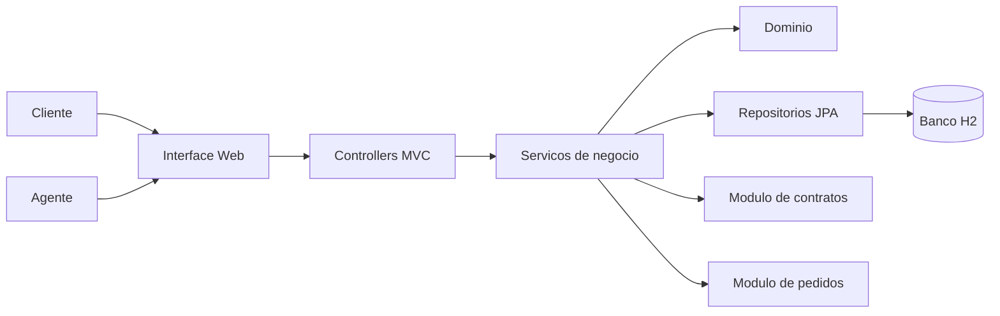
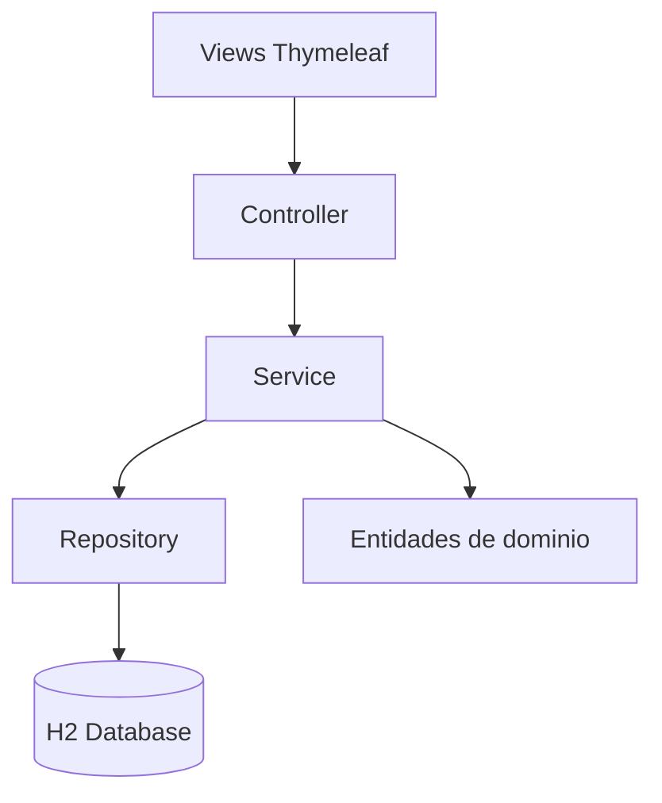
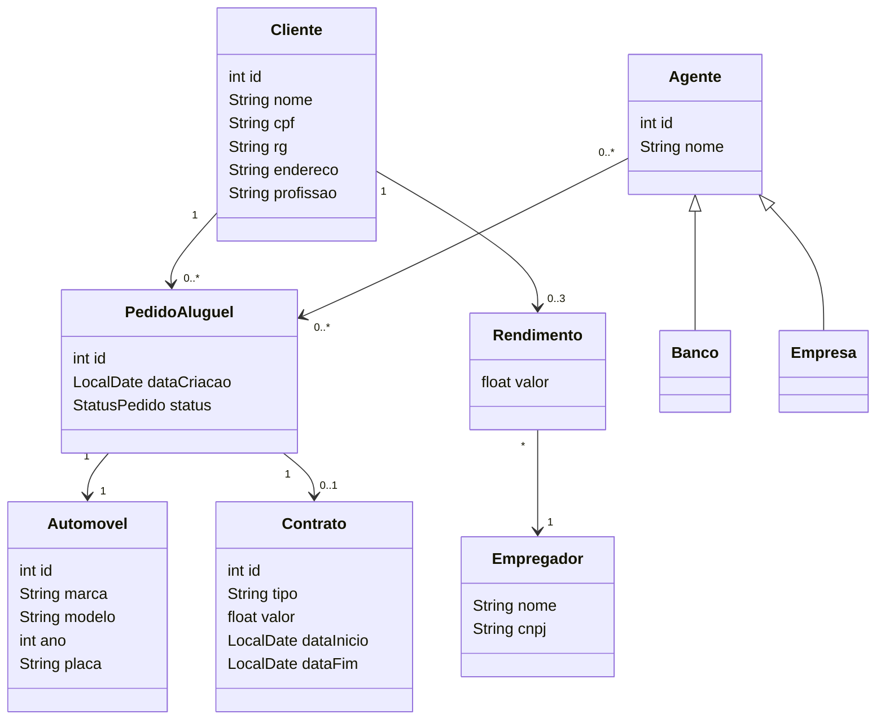

# Sistema de Aluguel de Carros

Projeto academico da disciplina de Laboratorio de Desenvolvimento de Software para apoio a gestao de alugueis de automoveis, com foco em cadastro de clientes, criacao e analise de pedidos, geracao de contratos e transferencia de propriedade de automoveis.

## Visao Geral

O sistema foi proposto para permitir que clientes realizem pedidos de aluguel pela internet e que agentes, como empresas e bancos, analisem a viabilidade financeira desses pedidos. Quando aprovado, o pedido pode gerar um contrato e atualizar a propriedade do automovel conforme as regras do negocio.

De acordo com a especificacao do laboratorio, o sistema deve:

- permitir cadastro e autenticacao de clientes;
- permitir criar, consultar, modificar e cancelar pedidos de aluguel;
- permitir que agentes analisem, aprovem ou reprovem pedidos;
- gerar contrato apos aprovacao;
- armazenar rendimentos do cliente, limitados a 3 registros;
- registrar automoveis e refletir sua propriedade conforme o contrato;
- atender a uma arquitetura MVC em Java.

## Estado Atual do Repositorio

No momento, o repositorio contem:

- configuracao inicial com `Gradle`;
- base de aplicacao Java com `Micronaut`;
- dependencias para web MVC, persistencia e views server-side;
- diagramas UML em `Diagrams/`;
- wrappers do Gradle para execucao do projeto.

No estado atual, ainda nao existe a pasta `src/` com a implementacao da aplicacao. Isso significa que a documentacao abaixo descreve o sistema modelado e a arquitetura planejada/estruturada ate agora, mas a implementacao funcional ainda esta em andamento.

## Stack Tecnologica

A configuracao atual do projeto indica o seguinte conjunto de tecnologias:

- `Java 17`
- `Gradle`
- `Micronaut`
- `Micronaut Data + Hibernate/JPA`
- `Thymeleaf` para renderizacao de paginas web
- `H2 Database` para banco de dados em tempo de execucao
- `JUnit 5` para testes

## Arquitetura Proposta

Pelo enunciado e pela configuracao atual, a arquitetura prevista e uma aplicacao web em Java no estilo MVC, organizada em camadas de apresentacao, regras de negocio e persistencia.

### Visao arquitetural



### Subsystems identificados no enunciado

O documento da atividade divide o sistema em dois grandes subsistemas:

- `Gestao de pedidos e contratos`
- `Construcao dinamica de paginas web`

### Arquitetura de implementacao esperada



## Diagramas

Os modelos UML ja presentes no repositorio estao na pasta `Diagrams/`:

- `Diagrams/CasoDeUso.drawio`
- `Diagrams/DiagramaDeClasses.drawio`

### Diagrama de Casos de Uso

O diagrama de casos de uso modelado no projeto contempla os seguintes atores e interacoes:

- `Cliente`
  - cadastrar-se
  - fazer login
  - criar pedido de aluguel
  - consultar pedido
  - modificar pedido
  - cancelar pedido
- `Agente`
  - analisar pedido
  - aprovar pedido
  - reprovar pedido
  - modificar pedido
- especializacoes de `Agente`
  - `Empresa`
  - `Banco`

### Diagrama de Classes

Com base no modelo UML criado, as principais entidades do dominio sao:

- `Cliente`
- `Rendimento`
- `Empregador`
- `Automovel`
- `PedidoAluguel`
- `Contrato`
- `Agente`
- `Banco`
- `Empresa`

Resumo visual da modelagem atual:



## Regras de Negocio Levantadas

As regras levantadas ate o momento a partir do enunciado e das historias de usuario sao:

- o sistema so pode ser utilizado apos cadastro previo;
- o CPF do cliente deve ser unico;
- o cliente pode possuir no maximo `3` rendimentos;
- apenas clientes autenticados podem criar pedidos;
- pedidos iniciam com status `PENDENTE`;
- pedidos `PENDENTE` podem ser modificados e cancelados;
- pedidos aprovados ou reprovados nao podem ser modificados;
- contratos so podem ser gerados para pedidos `APROVADO`;
- a propriedade do automovel pode variar conforme o tipo de contrato;
- o aluguel pode estar associado a contrato de credito concedido por banco agente.

## Estrutura Atual do Projeto

```text
.
|-- Diagrams/
|   |-- CasoDeUso.drawio
|   `-- DiagramaDeClasses.drawio
|-- gradle/
|-- build.gradle
|-- gradle.properties
|-- gradlew
|-- gradlew.bat
|-- settings.gradle
`-- README.md
```

## Como Executar

### Pre-requisitos

- `Java 17`

### Comandos

No Windows:

```powershell
.\gradlew.bat run
```

Para compilar/testar:

```powershell
.\gradlew.bat build
.\gradlew.bat test
```

> Observacao: a configuracao de build ja esta preparada, mas a implementacao da aplicacao ainda nao foi adicionada em `src/`. Portanto, a execucao completa do sistema depende da criacao do codigo-fonte.

## Roadmap Sugerido

Com base no laboratorio e no estado atual do repositorio, os proximos passos mais naturais sao:

1. criar a estrutura `src/main/java` e `src/main/resources`;
2. implementar o CRUD de cliente;
3. adicionar autenticacao/login;
4. implementar fluxo de pedido de aluguel;
5. persistir entidades com JPA/H2;
6. criar views com Thymeleaf;
7. revisar os diagramas conforme a implementacao evoluir.

## Referencias

- Enunciado da atividade: `LABORATÓRIO 02 - Sistema de Aluguel de Carros.pdf`
- Diagramas UML: `Diagrams/CasoDeUso.drawio` e `Diagrams/DiagramaDeClasses.drawio`
