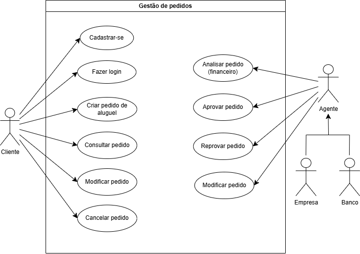

<div align="center">

# Sistema de Aluguel de Carros

<p>
  <strong>Projeto acadêmico</strong> da disciplina de <strong>Laboratório de Desenvolvimento de Software</strong>
  voltado à modelagem e implementação de uma plataforma web para <strong>aluguel de automóveis</strong>.
</p>

<p>
  Cadastro de clientes • Gestão de pedidos • Análise financeira • Contratos • Transferência de propriedade
</p>

<p>
  
  
  
  
  
  
</p>

<p>
  <a href="#sobre-o-projeto"></a>
  <a href="#arquitetura-proposta"></a>
  <a href="#diagramas-do-projeto"></a>
  <a href="#histórias-de-usuário"></a>
  <a href="#como-executar"></a>
</p>

</div>

---

## Visão rápida

| Item | Resumo |
|---|---|
| **Contexto** | Projeto acadêmico para modelagem e implementação incremental de um sistema de aluguel de carros |
| **Arquitetura alvo** | Aplicação web em `Java` com padrão `MVC` |
| **Stack principal** | `Micronaut`, `Thymeleaf`, `JPA/Hibernate`, `H2`, `Gradle` |
| **Foco funcional** | Clientes, pedidos, análise financeira, contratos e propriedade do automóvel |
| **Situação atual** | Estrutura do projeto e documentação/modelagem prontas; implementação funcional ainda em construção |

## Sumário

- [Sobre o projeto](#sobre-o-projeto)
- [Objetivos do sistema](#objetivos-do-sistema)
- [Estado atual do repositório](#estado-atual-do-repositório)
- [Stack tecnológica](#stack-tecnológica)
- [Arquitetura proposta](#arquitetura-proposta)
- [Diagramas do projeto](#diagramas-do-projeto)
- [Modelo de domínio](#modelo-de-domínio)
- [Regras de negócio](#regras-de-negócio)
- [Histórias de usuário](#histórias-de-usuário)
- [Estrutura atual do projeto](#estrutura-atual-do-projeto)
- [Como executar](#como-executar)
- [Roadmap sugerido](#roadmap-sugerido)
- [Referências](#referências)

## Sobre o projeto

O sistema foi concebido para permitir que clientes realizem pedidos de aluguel de automóveis pela internet, enquanto agentes, como empresas e bancos, possam analisar a viabilidade financeira dessas solicitações.

Após a aprovação do pedido, o sistema deve possibilitar a geração de contrato e refletir a propriedade do automóvel conforme as regras definidas pelo tipo de contrato.

> **Resumo executivo**
>
> A proposta do projeto é reunir em uma única aplicação web os fluxos de **cadastro**, **autenticação**, **gestão de pedidos**, **análise financeira** e **formalização contratual**, mantendo alinhamento com a modelagem UML e com os requisitos acadêmicos definidos na disciplina.

## Objetivos do sistema

De acordo com a especificação do laboratório, o sistema deve:

- permitir cadastro e autenticação de clientes;
- permitir criar, consultar, modificar e cancelar pedidos de aluguel;
- permitir que agentes analisem, aprovem ou reprovem pedidos;
- gerar contrato após a aprovação;
- armazenar rendimentos do cliente, limitados a `3` registros;
- registrar automóveis e refletir sua propriedade conforme o contrato;
- atender a uma arquitetura `MVC` em `Java`.

## Estado atual do repositório

Atualmente, o repositório já possui a base de configuração do projeto e os artefatos de modelagem, incluindo:

- configuração inicial com `Gradle`;
- definição de aplicação `Java` com `Micronaut`;
- dependências para camada web, persistência e views server-side;
- diagramas UML em `Diagrams/`;
- wrappers do Gradle para execução e build.

> **Importante**
>
> Neste momento, o projeto ainda não possui a pasta `src/` com a implementação da aplicação. Portanto, este README documenta o estado atual da modelagem, da arquitetura planejada e dos requisitos levantados até agora.

### Entregáveis já produzidos

| Entregável | Situação |
|---|---|
| Estrutura inicial do projeto | `Concluído` |
| Configuração com `Gradle` | `Concluído` |
| Base com `Micronaut` | `Concluído` |
| Diagrama de Casos de Uso | `Concluído` |
| Diagrama de Classes | `Concluído` |
| Implementação em `src/` | `Pendente` |

## Stack tecnológica

| Tecnologia | Papel no projeto |
|---|---|
| `Java 17` | Linguagem principal da aplicação |
| `Gradle` | Build, execução e gerenciamento de dependências |
| `Micronaut` | Base da aplicação web |
| `Micronaut Data + Hibernate/JPA` | Persistência e acesso a dados |
| `Thymeleaf` | Renderização de páginas no servidor |
| `H2 Database` | Banco de dados para ambiente local |
| `JUnit 5` | Testes automatizados |

## Arquitetura proposta

Pelo enunciado e pela configuração presente no projeto, a solução foi pensada como uma aplicação web em `Java`, seguindo o padrão `MVC`, com separação entre apresentação, regras de negócio e persistência.

### Visão arquitetural

```text
Cliente / Agente
       |
       v
 Interface Web
       |
       v
 Controllers MVC
       |
       v
 Serviços de Negócio
       |
       +--> Gestão de Clientes
       +--> Gestão de Rendimentos
       +--> Gestão de Pedidos
       +--> Gestão de Contratos
       |
       v
 Repositórios JPA
       |
       v
   Banco H2
```

### Subsistemas identificados no enunciado

O documento da atividade divide o sistema em dois grandes subsistemas:

- `Gestão de pedidos e contratos`
- `Construção dinâmica das páginas web`

### Arquitetura de implementação esperada

| Camada | Responsabilidade |
|---|---|
| `Views` | Renderização das páginas com `Thymeleaf` |
| `Controllers` | Recebimento das requisições e controle do fluxo MVC |
| `Services` | Aplicação das regras de negócio |
| `Repositories` | Persistência com `JPA/Hibernate` |
| `Database` | Armazenamento local com `H2` |

## Diagramas do projeto

Os modelos UML já presentes no repositório estão na pasta `Diagrams/`:

- `Diagrams/CasoDeUso.drawio`
- `Diagrams/DiagramaDeClasses.drawio`

Esses arquivos também possuem versão em imagem e podem ser abertos no [diagrams.net](https://www.diagrams.net/) para edição.

### Diagrama de Casos de Uso

<div align="center">
  
  <p><em>Visão funcional dos atores e das principais interações do sistema.</em></p>
</div>

O diagrama de casos de uso modela os principais atores e suas interações:

| Ator | Ações principais |
|---|---|
| `Cliente` | cadastrar-se, fazer login, criar pedido, consultar pedido, modificar pedido, cancelar pedido |
| `Agente` | analisar pedido, aprovar pedido, reprovar pedido, modificar pedido |
| `Empresa` | especialização de `Agente` |
| `Banco` | especialização de `Agente` |

## Modelo de domínio

### Diagrama de Classes

<div align="center">
  
  <p><em>Estrutura conceitual das entidades, relacionamentos e responsabilidades do domínio.</em></p>
</div>

### Entidades principais

| Entidade | Responsabilidade |
|---|---|
| `Cliente` | Representa o usuário que solicita o aluguel |
| `Rendimento` | Registra a capacidade financeira do cliente |
| `Empregador` | Identifica a origem do rendimento |
| `Automóvel` | Representa o veículo alugado no sistema |
| `PedidoAluguel` | Controla a solicitação de aluguel e seu status |
| `Contrato` | Formaliza a relação de aluguel após aprovação |
| `Agente` | Analisa pedidos e decide pela aprovação ou reprovação |
| `Banco` | Pode conceder crédito vinculado ao pedido |
| `Empresa` | Participa da gestão do aluguel |

## Regras de negócio

As principais regras de negócio levantadas até o momento são:

- o sistema só pode ser utilizado após cadastro prévio;
- o `CPF` do cliente deve ser único;
- o cliente pode possuir no máximo `3` rendimentos;
- apenas clientes autenticados podem criar pedidos;
- pedidos iniciam com status `PENDENTE`;
- pedidos com status `PENDENTE` podem ser modificados e cancelados;
- pedidos aprovados ou reprovados não podem ser modificados;
- contratos só podem ser gerados para pedidos `APROVADO`;
- a propriedade do automóvel pode variar conforme o tipo de contrato;
- o aluguel pode estar associado a contrato de crédito concedido por banco agente.

### Restrições centrais do domínio

| Regra | Descrição |
|---|---|
| `CPF único` | Não é permitido cadastrar dois clientes com o mesmo CPF |
| `Máximo de rendimentos` | Cada cliente pode possuir até `3` rendimentos |
| `Pedido pendente` | Apenas pedidos `PENDENTE` podem ser alterados ou cancelados |
| `Contrato condicionado` | O contrato só pode ser gerado após aprovação |
| `Autenticação` | Apenas usuários autenticados podem criar pedidos |

## Histórias de usuário

### Resumo funcional

| ID | História | Ator |
|---|---|---|
| `HU01` | Cadastro de cliente | Cliente |
| `HU02` | Login | Cliente |
| `HU03` | Criar pedido de aluguel | Cliente |
| `HU04` | Consultar pedido | Cliente |
| `HU05` | Modificar pedido | Cliente |
| `HU06` | Cancelar pedido | Cliente |
| `HU07` | Analisar pedido | Agente |
| `HU08` | Aprovar pedido | Agente |
| `HU09` | Reprovar pedido | Agente |
| `HU10` | Gerar contrato | Sistema |
| `HU11` | Gerenciar rendimentos | Cliente |
| `HU12` | Transferência de propriedade de automóvel | Sistema |

<details>
<summary><strong>HU01 - Cadastro de Cliente</strong></summary>

**História**  
Como cliente, quero me cadastrar no sistema para poder solicitar aluguel de automóveis.

**Critérios de aceitação**

- Dado que estou na tela de cadastro;
- quando informo todos os dados corretamente;
- então o sistema deve cadastrar o cliente com sucesso.
- Dado que o CPF já existe;
- então o sistema deve impedir o cadastro.

</details>

<details>
<summary><strong>HU02 - Login</strong></summary>

**História**  
Como cliente, quero fazer login para acessar minhas funcionalidades no sistema.

**Critérios de aceitação**

- Dado que informo credenciais válidas;
- então devo acessar o sistema.
- Dado que informo dados inválidos;
- então devo receber uma mensagem de erro.

</details>

<details>
<summary><strong>HU03 - Criar Pedido de Aluguel</strong></summary>

**História**  
Como cliente, quero criar um pedido de aluguel para solicitar um automóvel.

**Critérios de aceitação**

- Dado que estou logado;
- quando seleciono um automóvel válido;
- então o sistema deve criar o pedido com status `PENDENTE`.
- Dado que não estou logado;
- então não posso criar pedido.

</details>

<details>
<summary><strong>HU04 - Consultar Pedido</strong></summary>

**História**  
Como cliente, quero consultar meus pedidos para acompanhar o status.

**Critérios de aceitação**

- Dado que tenho pedidos cadastrados;
- quando acesso a lista;
- então vejo todos os pedidos com seus respectivos status.

</details>

<details>
<summary><strong>HU05 - Modificar Pedido</strong></summary>

**História**  
Como cliente, quero modificar um pedido para alterar informações antes da aprovação.

**Critérios de aceitação**

- Dado que o pedido está com status `PENDENTE`;
- quando solicito alteração;
- então o sistema deve permitir a modificação.
- Dado que o pedido já foi aprovado ou reprovado;
- então o sistema não deve permitir alteração.

</details>

<details>
<summary><strong>HU06 - Cancelar Pedido</strong></summary>

**História**  
Como cliente, quero cancelar um pedido para desistir do aluguel.

**Critérios de aceitação**

- Dado que o pedido está com status `PENDENTE`;
- quando solicito cancelamento;
- então o status deve ser alterado para `CANCELADO`.

</details>

<details>
<summary><strong>HU07 - Analisar Pedido</strong></summary>

**História**  
Como agente, quero analisar pedidos para avaliar a viabilidade financeira.

**Critérios de aceitação**

- Dado que existe um pedido pendente;
- quando o agente acessa o pedido;
- então deve visualizar os dados do cliente, rendimentos e automóvel.

</details>

<details>
<summary><strong>HU08 - Aprovar Pedido</strong></summary>

**História**  
Como agente, quero aprovar pedidos para permitir a execução do contrato.

**Critérios de aceitação**

- Dado que o pedido foi analisado;
- quando o agente aprova o pedido;
- então o status deve ser alterado para `APROVADO`.
- e o sistema deve permitir a geração de contrato.

</details>

<details>
<summary><strong>HU09 - Reprovar Pedido</strong></summary>

**História**  
Como agente, quero reprovar pedidos para negar solicitações inválidas.

**Critérios de aceitação**

- Dado que o pedido não atende aos critérios;
- quando o agente reprova o pedido;
- então o status deve ser alterado para `REPROVADO`.

</details>

<details>
<summary><strong>HU10 - Gerar Contrato</strong></summary>

**História**  
Como sistema, quero gerar um contrato após a aprovação para formalizar o aluguel.

**Critérios de aceitação**

- Dado que o pedido foi aprovado;
- quando o contrato é gerado;
- então deve conter `tipo`, `valor`, `data de início` e `data de fim`.

</details>

<details>
<summary><strong>HU11 - Gerenciar Rendimentos</strong></summary>

**História**  
Como cliente, quero cadastrar meus rendimentos para comprovar minha capacidade financeira.

**Critérios de aceitação**

- Dado que o cliente possui menos de `3` rendimentos;
- quando adiciona um novo rendimento;
- então o sistema deve permitir.
- Dado que o cliente já possui `3` rendimentos;
- então o sistema deve impedir a adição de novos.

</details>

<details>
<summary><strong>HU12 - Transferência de Propriedade de Automóvel</strong></summary>

**História**  
Como sistema, quero transferir a propriedade de um automóvel para refletir as condições do contrato.

**Critérios de aceitação**

- Dado que existe um contrato válido;
- quando a transferência é realizada;
- então o proprietário do automóvel deve ser atualizado corretamente.

</details>

## Estrutura atual do projeto

```text
.
|-- Diagrams/
|   |-- CasoDeUso.drawio
|   |-- CasoDeUso.drawio.png
|   |-- DiagramaDeClasses.drawio
|   `-- DiagramaDeClasses.drawio.png
|-- gradle/
|-- build.gradle
|-- gradle.properties
|-- gradlew
|-- gradlew.bat
|-- settings.gradle
`-- README.md
```

## Como executar

### Pré-requisitos

- `Java 17`
- `Git` opcional para versionamento e clonagem

### Comandos

No Windows:

```powershell
.\gradlew.bat run
```

Para compilar e testar:

```powershell
.\gradlew.bat build
.\gradlew.bat test
```

### Verificação do ambiente

```powershell
java -version
```

> **Observação**
>
> A configuração de build já está preparada, mas a implementação da aplicação ainda não foi adicionada em `src/`. Portanto, a execução completa do sistema depende da criação do código-fonte.

## Roadmap sugerido

Com base no laboratório e no estado atual do repositório, os próximos passos mais naturais são:

1. criar a estrutura `src/main/java` e `src/main/resources`;
2. implementar o CRUD de cliente;
3. adicionar autenticação e login;
4. implementar o fluxo de pedido de aluguel;
5. persistir entidades com `JPA` e `H2`;
6. criar views com `Thymeleaf`;
7. revisar os diagramas conforme a implementação evoluir.

### Próximos marcos esperados

| Sprint | Entrega esperada |
|---|---|
| `Sprint 01` | Modelagem UML e histórias de usuário |
| `Sprint 02` | Revisão dos diagramas e CRUD de cliente |
| `Sprint 03` | Protótipo funcional com criação e consulta de pedidos |

## Referências

- Enunciado da atividade: `LABORATÓRIO 02 - Sistema de Aluguel de Carros.pdf`
- Diagramas UML: `Diagrams/CasoDeUso.drawio` e `Diagrams/DiagramaDeClasses.drawio`
